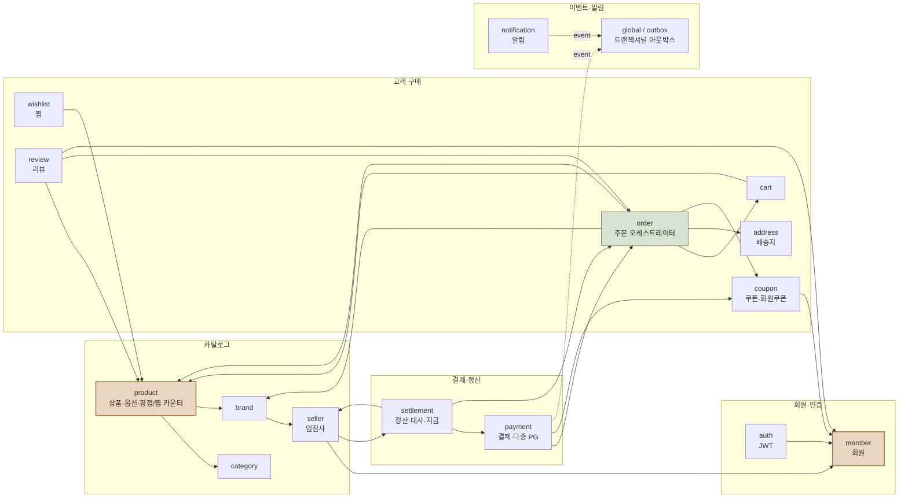
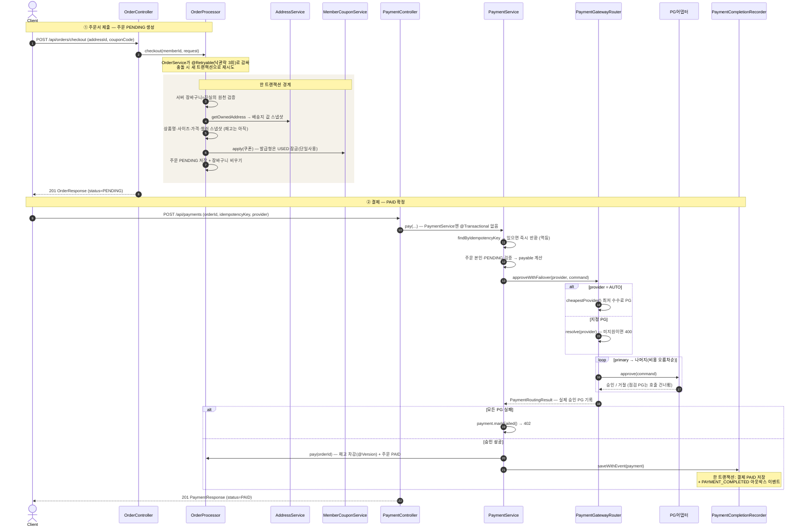
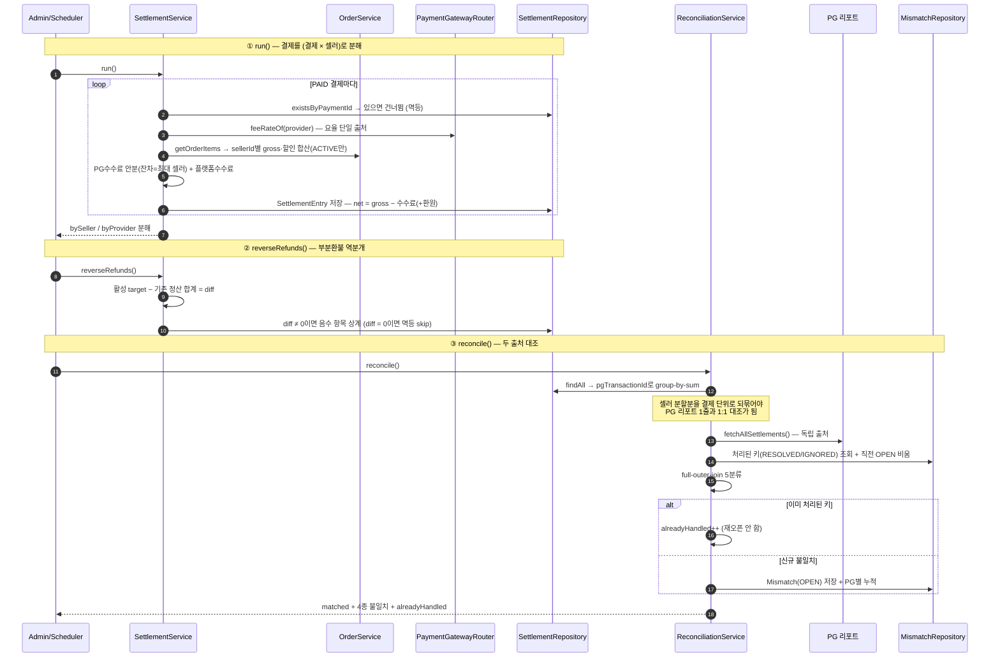
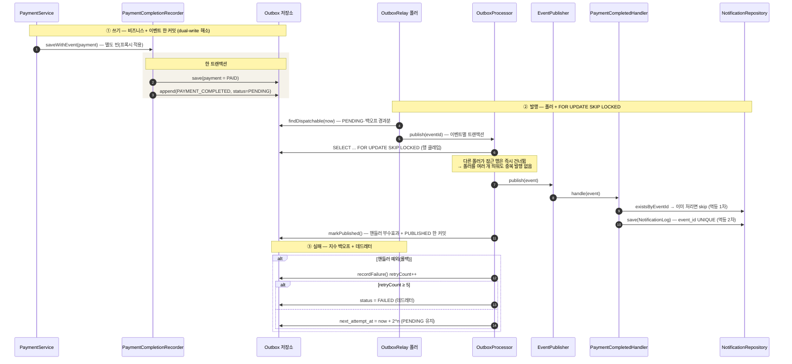
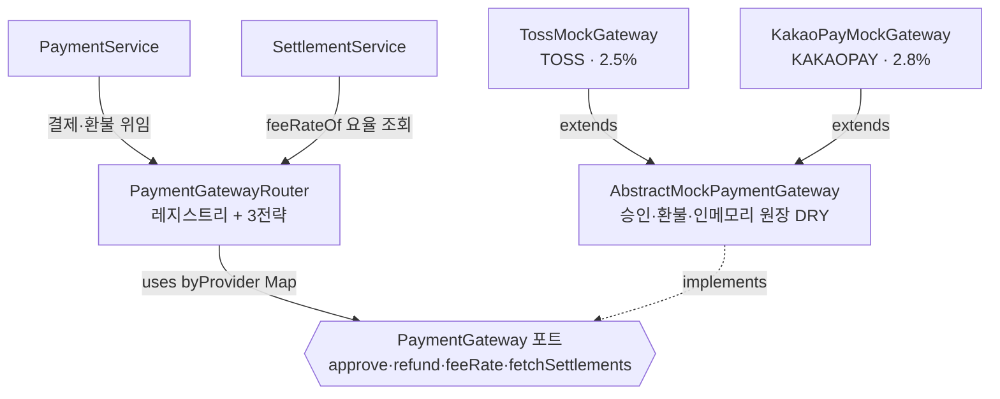

# 아키텍처 다이어그램 (발표용)

> 발표·면접에서 "이 기능이 이 흐름으로 동작합니다"를 30초에 설명하기 위한 그림 모음.
> 모두 **mermaid** — GitHub에서 바로 렌더되고, 슬라이드엔 캡처해서 붙이면 된다.
> 각 그림은 실제 클래스·메서드명에 맞춰 그렸다(`docs/adr/`의 결정 기록과 짝).
>
> 작성 근거: 코드 매핑(2026-06-15). 결정 배경은 [ADR 인덱스](adr/README.md), 시간순 기록은 [dev-log](dev-log.md).

---

## 1. 도메인 맵 — bounded context와 ID 참조 경계

**핵심 설계 원칙을 한 장으로.** 패키지는 기술 계층이 아니라 **도메인 단위**로 자르고, 애그리거트 간 참조는 항상 **ID(Long)** 로만 한다(객체 연관 금지). 그래서 화살표는 "객체 그래프"가 아니라 "어느 도메인이 어느 도메인을 *읽거나 호출*하는가"다.

**읽는 법**
- **허브(`product`·`member`, 진한 색)** — 가장 많은 도메인이 의존하는 안정적 코어. `member`는 어디에도 나가는 의존이 없는 **순수 피의존 노드**(가장 안정적).
- **오케스트레이터(`order`)** — 팬아웃이 가장 큼(cart·product·address·brand·coupon). 구매 흐름의 조립 지점.
- **하위 소비자(`settlement`)** — 상위 도메인(payment·order·seller)을 **읽어서** 가공하는 단방향 소비자.
- **순환 없음(DAG)** — `payment↔order`, `seller↔settlement`처럼 양방향처럼 보이는 쌍이 있지만, 한쪽은 서비스 호출·다른 쪽은 리포지토리/이벤트로 **계층이 갈려** 런타임 빈 생성 사이클이 없다. 코드 주석에도 "주문이 결제를 거꾸로 호출하면 순환이라 결제→주문 단방향으로 묶는다"고 명시.
- **점선 `event`** — 직접 서비스 의존이 아니라 아웃박스/이벤트를 통한 **느슨한 결합**.

---

## 2. 시퀀스 — 체크아웃 → 결제 (페일오버)

구매의 두 단계: **주문서 제출(PENDING 생성)** 과 **결제(PAID 확정)**. 재고는 주문이 아니라 **결제 승인 시점**에 차감된다.

**발표 포인트**
- **트랜잭션 경계 분리** — `PaymentService.pay`엔 `@Transactional`이 **일부러 없다**. 재고 차감을 `OrderProcessor.pay`(별도 빈의 `@Transactional`+`@Retryable`)에 위임해, 낙관적 락 충돌 시 **새 트랜잭션으로 재시도**가 가능하게 한다(같은 빈 self-invocation이면 프록시가 안 걸려 트랜잭션이 무효 — Spring AOP 함정 회피).
- **멱등** — 진입 즉시 `idempotencyKey`로 기존 결제를 찾아 PG 호출·재고 차감 없이 반환(더블클릭·재시도 방어), DB UNIQUE가 최후 방어선, 상태머신 가드(PENDING 아니면 409).
- **페일오버** — 전략은 `PaymentGatewayRouter` **한 곳에 가둠**. 실제 승인 PG를 결제에 기록해 환불·정산이 그 PG를 따라간다.

---

## 3. 시퀀스 — 정산 → 대사 (group-by-sum)

"매출 ≠ 결제액 ≠ 셀러 실수령"을 모델링한 핵심. 결제를 **(결제 × 셀러)** 로 분해하고, 대사는 두 진실의 출처(우리 정산 ↔ PG 리포트)를 대조한다.

**발표 포인트**
- **group-by-sum이 왜 필요한가** — 정산은 셀러별로 한 결제가 여러 행으로 쪼개진다(N행). 대사는 결제 단위로 PG 1줄과 비교해야 하므로, 우리 항목을 `pgTransactionId`로 **합산해서 되묶은 뒤** 대조한다. 정산 산식이 `Σ(할인 후 셀러 몫) = payable(고객 결제액)`이 되도록 설계돼, 합치면 PG 보고액과 같아져 **MATCHED**.
- **5분류** — MISSING_IN_PG / MISSING_IN_OURS / STATUS_MISMATCH(PG가 REFUNDED) / AMOUNT_MISMATCH / MATCHED.
- **예외 큐** — OPEN 불일치만 스냅샷하고, 사람이 RESOLVED/IGNORED 처리한 건 재대사에서 **다시 깨우지 않는다**(`alreadyHandled`).

---

## 4. 시퀀스 — 트랜잭셔널 아웃박스 (발행 → 소비)

결제 완료라는 "상태 변경"과 "이벤트 발행"을 **유실/유령 없이** 잇는 방법. dual-write 문제를 로컬 DB 한 트랜잭션으로 해소한다.

**발표 포인트**
- **dual-write 해소** — 메시지를 브로커에 직접 쏘지 않고, 같은 DB·같은 트랜잭션에 `outbox_event(PENDING)`를 INSERT. 비즈니스 상태와 이벤트가 **같이 커밋되거나 같이 롤백** → 유실/유령이 구조적으로 불가능.
- **at-least-once → 멱등 소비** — 폴러 발행은 "적어도 한 번". 소비자가 `event_id` UNIQUE로 중복을 흡수해 **effectively-once** 효과.
- **포트-어댑터** — `EventPublisher`가 포트라, in-process 디스패치를 추후 Kafka/RabbitMQ 어댑터로 바꿔도 결제·폴러 코드는 변경 0.

---

## 5. 컴포넌트 — 다중 PG 포트-어댑터

`PaymentGateway` 포트가 **진짜 교체/증식 가능한지** 증명한 구조. 라우팅 전략과 수수료율의 단일 출처가 핵심.

**발표 포인트**
- **3 라우팅 전략(라우터에 가둠)** — ① 클라이언트 선택(요청 provider) ② **AUTO = 비용기반 최저가** ③ **순차 페일오버**(요청 PG 실패 시 비용 오름차순으로 다음 PG, 실제 승인 PG를 기록).
- **요율 = PG 고유 속성** — 수수료율의 단일 출처는 `PaymentGateway.feeRate()`. 라우팅 비용 계산과 정산 수수료가 **같은 출처**를 읽어, "싸다고 골라 결제했는데 정산은 다르게 떼는" 불일치가 원천 봉쇄. 의존은 `settlement → payment` 정방향(순환 없음).
- **DIP** — `PaymentService`는 라우터만 알고 구체 PG를 모른다. 실제 PG 연동은 같은 포트에 어댑터만 추가하면 됨.

---

## 부록 — 핵심 클래스 좌표

| 흐름 | 진입/핵심 클래스 |
|---|---|
| 체크아웃 | [OrderController](../backend/src/main/java/com/commerce/api/order/controller/OrderController.java) · [OrderProcessor](../backend/src/main/java/com/commerce/api/order/service/OrderProcessor.java) |
| 결제·라우팅 | [PaymentService](../backend/src/main/java/com/commerce/api/payment/service/PaymentService.java) · [PaymentGatewayRouter](../backend/src/main/java/com/commerce/api/payment/gateway/PaymentGatewayRouter.java) |
| 정산·대사 | [SettlementService](../backend/src/main/java/com/commerce/api/settlement/service/SettlementService.java) · [ReconciliationService](../backend/src/main/java/com/commerce/api/settlement/service/ReconciliationService.java) |
| 아웃박스 | [PaymentCompletionRecorder](../backend/src/main/java/com/commerce/api/payment/service/PaymentCompletionRecorder.java) · [OutboxRelay](../backend/src/main/java/com/commerce/api/global/outbox/OutboxRelay.java) · [OutboxProcessor](../backend/src/main/java/com/commerce/api/global/outbox/OutboxProcessor.java) |
